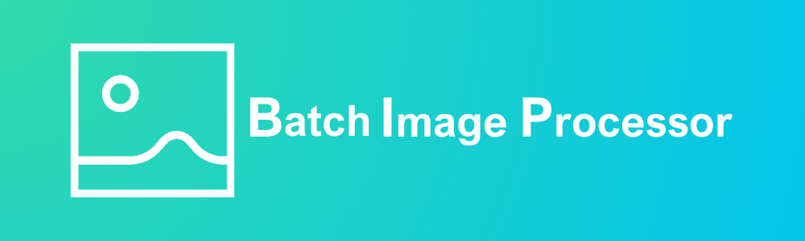

# BIP - BatchImageProcessor

    

BatchImageProcessor (or BIP for short) is a simple, Pillow based app that takes a batch of images from a specified directory and applies scheduled changes to them. I'll go into detail below.

If you'd like to you can follow the project on my portfolio website, you just have to click <a href="https://aleksanderc.pythonanywhere.com/wip.html">this link</a>.

## Requirements

- Currently supported operating systems:
  - 🍎 MacOS - ✅
  - 🪟 Windows - ⛔️ - I haven't tested it. Might work, might not, I'll check later after I'm done with the backend
  - 🐧 Linux - ❓ - It could work...?

## Background

At long last I upload a project that sort of started my interest in programmig. Why do I write that? Well it was the first bit of code that actuall showed me, that learning Python won't just boil down to writing silly exercises and that I can actually solve some real-life problems.

Answering the question from the introduction - what scheduled changes? For now you can quickly change extensions, resize the images and apply filters. Why may you need it? Well if you've read so far either a use came to your mind by now. Myself, I found it usefull while preparing images for a neural network I wanted to test. This app made it quite easy to resize the images, apply filters to mix up the data etc.

Currently (v. 0.1.0), the code in this repository is an empty husk - it just looks like I want the final version to appear on the screen. It's missing the "Resizing" tab, and the code in the `outdated_main.py` has nothing to do with the actual app. I will adapt the code I used to fit this GUI, but that will come at a later time.

## What's already happened?

<i>-- 05.10.2023 --</i>

A tiny little update to version 0.1.1 in which I added a third (but second in order) tab to the main screen. It will allow the user to handle resizing files either freely or by using set width to height ratio. Other than that no changes in functionality. Some new images were added to the resources. They will probably be used in the future, however I will see about that and might change them at some point.

<i>-- 25.09.2023 --</i>

The repository was created, uncomplete 0.1.0 version of the frontend was uploaded, `README.md` was created and updated. From this point onward any changes will get directly commited to this repository and then descirbed here and on my portfolio page.
